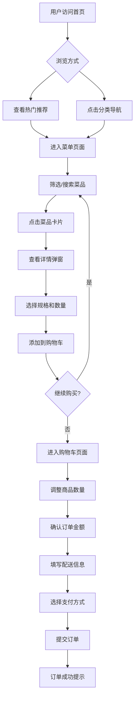

## 1. 产品概述
一款现代化的在线外卖点餐平台，提供便捷的美食浏览、购物车管理和下单功能。
- 主要用途：让用户能够通过网页浏览餐厅菜单、选择美食并完成在线点餐流程
- 目标用户：追求便捷用餐体验的消费者，支持桌面端和移动端访问

## 2. 核心功能

### 2.1 用户角色
| 角色 | 注册方式 | 核心权限 |
|------|----------|----------|
| 普通用户 | 无需注册 | 浏览菜单、添加购物车、提交订单 |
| 访客 | 直接访问 | 浏览所有菜品信息 |

### 2.2 功能模块
1. **首页**: 品牌展示、热门推荐、分类导航、促销活动
2. **菜单页面**: 分类筛选、菜品列表、搜索功能、详情查看
3. **购物车页面**: 商品管理、数量调整、价格计算、优惠显示
4. **结算页面**: 配送信息填写、支付方式选择、订单确认

### 2.3 页面详情
| 页面名称 | 模块名称 | 功能描述 |
|-----------|----------|----------|
| 首页 | Hero 区域 | 品牌标语、主视觉背景、CTA 按钮 |
| 首页 | 热门推荐 | 精选菜品轮播展示、评分与价格 |
| 首页 | 分类导航 | 图标化分类入口（中餐、西餐、甜点等） |
| 菜单页面 | 筛选栏 | 分类标签切换、搜索框、排序选项 |
| 菜单页面 | 菜品网格 | 卡片式展示、图片、名称、价格、加入按钮 |
| 菜单页面 | 菜品详情弹窗 | 大图展示、详细描述、规格选择、数量选择 |
| 购物车页面 | 商品列表 | 已选商品、数量调整、删除操作、小计计算 |
| 购物车页面 | 订单摘要 | 商品总价、配送费、优惠券、实付金额 |
| 结算页面 | 表单区域 | 收货地址、联系方式、备注信息 |
| 结算页面 | 支付方式 | 在线支付、货到付款等选项 |
| 结算页面 | 订单确认 | 最终金额展示、提交按钮 |

## 3. 核心流程
用户从首页进入 → 浏览热门推荐或点击分类 → 在菜单页面筛选和搜索菜品 → 点击菜品查看详情 → 选择规格和数量添加到购物车 → 继续选购或进入购物车 → 确认商品和金额 → 填写配送信息 → 选择支付方式 → 提交订单成功

## 4. 用户界面设计
### 4.1 设计风格
- **主色调**: 温暖的橙色系 (#FF6B35) + 清新的绿色点缀 (#00B894)
- **辅助色**: 米白色背景 (#FFF9F5)、深灰色文字 (#2D3436)
- **按钮风格**: 圆角胶囊状、渐变色、悬停放大效果、点击反馈动画
- **字体风格**: 标题使用粗体现代无衬线字体、正文使用易读的正文字体
- **布局风格**: 卡片式设计、大量留白、圆角元素、柔和阴影
- **图标风格**: 线性图标为主、圆角处理、色彩统一
- **视觉特色**: 食物摄影风格、暖色滤镜、微妙的悬浮动效

### 4.2 页面设计概览
| 页面名称 | 模块名称 | UI 元素说明 |
|-----------|----------|-------------|
| 首页 | Hero 区域 | 全屏背景图、大标题渐变文字、CTA 渐变按钮、向下滚动指示器动画 |
| 首页 | 热门推荐 | 横向滚动卡片、悬停上浮效果、评分星星、价格标签 |
| 首页 | 分类导航 | 2x3 网格布局、彩色图标背景、分类名称、点击波纹效果 |
| 菜单页面 | 筛选栏 | 固定顶部、标签式切换、搜索输入框带图标、下拉排序 |
| 菜单页面 | 菜品网格 | 响应式网格、卡片阴影、图片懒加载、快速添加按钮 |
| 菜单页面 | 详情弹窗 | 居中模态框、遮罩层、大图轮播、规格选择器、底部固定操作栏 |
| 购物车页面 | 商品列表 | 列表式布局、左侧缩略图、中间信息、右侧操作按钮、滑动删除 |
| 购物车页面 | 订单摘要 | 固定底部卡片、分项明细、优惠标签、总价高亮 |
| 结算页面 | 表单区域 | 分组表单、输入框聚焦效果、地址自动补全提示 |
| 结算页面 | 支付方式 | 单选卡片组、图标+文字、选中状态边框高亮 |
| 结算页面 | 订单确认 | 总结卡片、最终金额大字显示、提交按钮渐变色、加载状态 |

### 4.3 响应式设计
- **桌面优先** (≥1024px): 完整的多列布局、侧边栏导航、大尺寸卡片
- **平板适配** (768px-1023px): 自适应双列布局、折叠部分侧边栏
- **移动端优化** (<768px): 单列堆叠布局、底部固定操作栏、触摸友好的按钮尺寸(≥44px)
- **触控优化**: 所有可点击元素足够大的触摸区域、避免误触、滑动操作支持

### 4.4 动画与交互
- **页面过渡**: 淡入淡出、轻微上移效果、300ms 缓动
- **悬停反馈**: 卡片上浮(Y轴 -8px)、阴影加深、图片微缩放(1.05x)
- **加载状态**: 骨架屏占位、脉冲动画、渐进式内容显示
- **操作反馈**: 按钮点击涟漪效果、添加购物车飞入动画、Toast 提示
- **滚动效果**: 视差滚动、元素渐显(staggered reveal)、粘性定位元素
