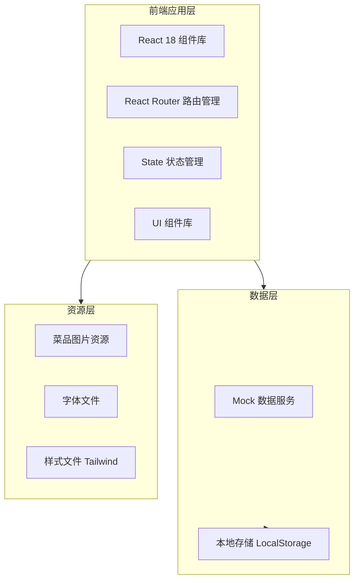
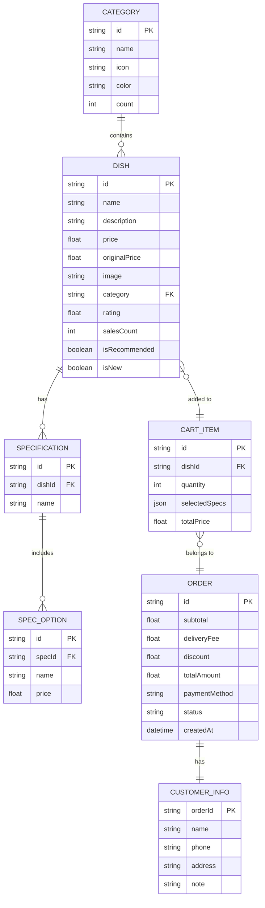

## 1. 架构设计



## 2. 技术选型
- **前端框架**: React@18 + Vite@5
- **样式方案**: Tailwind CSS@3 + CSS Modules（自定义动画）
- **路由管理**: React Router@6
- **状态管理**: React Context API + useReducer（轻量级状态）
- **构建工具**: Vite（快速开发服务器和优化构建）
- **图标库**: Lucide React（线性图标）
- **动画库**: Framer Motion（流畅的交互动画）
- **后端服务**: 无（纯前端应用，使用 Mock 数据）
- **数据持久化**: LocalStorage（购物车数据）
- **图片资源**: 使用 Unsplash/Pexels 的食物图片 URL

## 3. 路由定义
| 路由路径 | 页面名称 | 功能描述 |
|----------|----------|----------|
| `/` | 首页 | 品牌展示、热门推荐、分类入口 |
| `/menu` | 菜单页 | 菜品浏览、分类筛选、搜索 |
| `/menu/:category` | 分类菜单 | 特定分类下的菜品列表 |
| `/cart` | 购物车 | 商品管理、订单摘要 |
| `/checkout` | 结算页 | 信息填写、支付确认 |
| `/order/success` | 订单成功 | 成功提示、订单号展示 |

## 4. 数据模型

### 4.1 核心数据结构

#### 菜品数据 (Dish)
```typescript
interface Dish {
  id: string;
  name: string;
  description: string;
  price: number;
  originalPrice?: number;
  image: string;
  category: string;
  rating: number;
  salesCount: number;
  tags: string[];
  isRecommended: boolean;
  isNew: boolean;
  specifications?: Specification[];
}

interface Specification {
  name: string; // 规格/口味名称
  options: SpecOption[];
}

interface SpecOption {
  name: string;
  price: number; // 可能需要加价
}
```

#### 购物车项 (CartItem)
```typescript
interface CartItem {
  dish: Dish;
  quantity: number;
  selectedSpecs: Record<string, string>; // 选中的规格
  totalPrice: number;
}
```

#### 订单数据 (Order)
```typescript
interface Order {
  id: string;
  items: CartItem[];
  subtotal: number;
  deliveryFee: number;
  discount: number;
  totalAmount: number;
  customerInfo: CustomerInfo;
  paymentMethod: string;
  status: 'pending' | 'confirmed' | 'preparing' | 'delivering' | 'completed';
  createdAt: string;
  estimatedDeliveryTime: string;
}

interface CustomerInfo {
  name: string;
  phone: string;
  address: string;
  note?: string;
}
```

#### 分类数据 (Category)
```typescript
interface Category {
  id: string;
  name: string;
  icon: string;
  color: string;
  count: number;
}
```

### 4.2 ER 关系图



## 5. 项目目录结构

```
src/
├── components/           # 可复用组件
│   ├── common/          # 通用组件
│   │   ├── Button.jsx
│   │   ├── Card.jsx
│   │   ├── Modal.jsx
│   │   ├── Input.jsx
│   │   ├── Toast.jsx
│   │   └── Skeleton.jsx
│   ├── layout/          # 布局组件
│   │   ├── Header.jsx
│   │   ├── Footer.jsx
│   │   └── Layout.jsx
│   └── features/        # 业务组件
│       ├── DishCard.jsx
│       ├── CategoryNav.jsx
│       ├── CartItem.jsx
│       ├── OrderSummary.jsx
│       └── SearchBar.jsx
├── pages/               # 页面组件
│   ├── Home.jsx
│   ├── Menu.jsx
│   ├── Cart.jsx
│   ├── Checkout.jsx
│   └── OrderSuccess.jsx
├── context/             # React Context
│   ├── CartContext.jsx
│   └── ToastContext.jsx
├── hooks/               # 自定义 Hooks
│   ├── useCart.js
│   ├── useLocalStorage.js
│   └── useDebounce.js
├── data/                # Mock 数据
│   ├── dishes.js
│   ├── categories.js
│   └── recommendations.js
├── utils/               # 工具函数
│   ├── formatPrice.js
│   ├── generateOrderId.js
│   └── validators.js
├── styles/              # 全局样式
│   └── globals.css
├── App.jsx              # 应用根组件
└── main.jsx             # 入口文件
```

## 6. 关键技术实现要点

### 6.1 状态管理架构
- 使用 Context API 管理全局购物车状态
- 使用 useReducer 处理复杂的购物车操作（添加、删除、修改数量、清空）
- 使用 LocalStorage 持久化购物车数据
- Toast 通知系统独立 Context 管理

### 6.2 性能优化策略
- 图片懒加载（Intersection Observer API）
- 路由级别代码分割（React.lazy + Suspense）
- 虚拟滚动（长列表优化）
- Memo 优化（React.memo、useMemo、useCallback）
- 骨架屏加载体验

### 6.3 用户体验增强
- 响应式断点：mobile(<768px), tablet(768-1023px), desktop(≥1024px)
- 触摸手势支持（移动端滑动删除购物车项）
- 键盘导航支持（无障碍访问）
- 加载状态和错误边界处理
- 平滑滚动和锚点导航

### 6.4 数据 Mock 方案
- 使用静态 JS 对象模拟后端 API
- 包含 30+ 道菜品数据，覆盖多个分类
- 真实的图片 URL（Unsplash 高质量食物图片）
- 模拟网络延迟（可选，用于测试加载状态）

## 7. 开发规范
- **命名约定**: 组件名 PascalCase，文件名 PascalCase.jsx，工具函数 camelCase
- **代码风格**: ESLint + Prettier 统一格式化
- **Git 提交**: Conventional Commits 规范
- **注释要求**: 关键业务逻辑必须注释，复杂算法需详细说明
